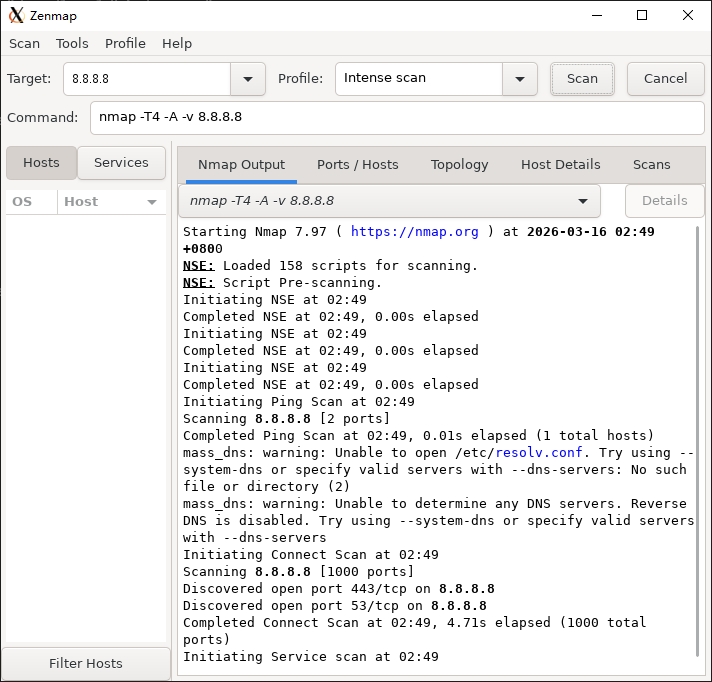

# cygport

> **把 Linux 网络工具原生移植到 Cygwin 的基础设施。**

---

## 背景：一条搁置了 20 年的路

2001 年，有人在 nmap 开发邮件列表问：

> "nmap 能用 Cygwin 的 gcc 编译吗？"

开发者的回答是：Unix 的 routing/pcap 算法在 Windows 上不工作。这条路就此搁置。

此后 20 年，社区里所谓的「nmap on Cygwin」方案，始终停留在这一行：

```bash
alias nmap="C:/Program Files (x86)/Nmap/nmap.exe"
```

一个指向 Windows 原生二进制的 alias。nmap 官方文档至今明确写道：

> *"Nmap doesn't maintain instructions for building Nmap under Cygwin."*

WinDivert 出现后，内核级数据包拦截在用户态变得可行。Npcap 取代了老旧的 WinPcap。技术条件早已成熟，但没有人把这些拼在一起。

**cygport 是这个空白的答案。** 不是 alias，不是 wrapper，是真正的移植。



*Nmap 7.97 + Zenmap GUI，原生运行于 Cygwin，2026-03-16*

---

## 移植一个工具，过去需要什么

在 cygport 之前，移植 nmap 的过程是全手工的：

1. **逐文件打补丁** — `nsock_pcap.h`、`netutil.cc`、`intf.c`、`nbase_config.h`……每个文件单独排查、单独修
2. **手写导入库** — 对着 `wpcap.dll`、`Packet.dll`、`cygctl1.dll` 各写一份 `.def`，再用 `dlltool` 生成 `.a`
3. **手写 pcap stub** — `pcap_get_selectable_fd()` Npcap 不支持，得自己写个空实现
4. **手调 Makefile** — `LIBS`、`CPPFLAGS` 逐项加，顺序还不能错
5. **必须用 Cygwin login shell 跑 configure** — MSYS2 shell 会把路径写成 `/c/cygwin64/...`，Makefile 全坏
6. **每次 configure 后重新修** — `nbase_config.h` 会被覆盖，`HAVE_ASNPRINTF` 得重新加

整个过程没有文档，靠的是一次次踩坑积累的经验。

### cygport 之后

| 问题 | 手工时代 | cygport |
|------|---------|---------|
| GNU 扩展 / IPv6 宏缺失 | 每个文件手改 | `-include cygctl_compat.h` 自动注入 |
| 接口名映射（eth0 ↔ NPF GUID） | 各工具重复实现 | `cygnet.dll` 统一提供 |
| Npcap 未安装时无法抓包 | 直接崩溃 | `cygnet.dll` 自动降级到 WinDivert |
| 导入库 | 每次手写 `.def` + `dlltool` | `-lcygnet -lcygctl1` 直接链接 |
| 移植下一个工具 | 从头踩一遍坑 | 框架已有，只补 tool-specific 补丁 |

---

## 组件

| 组件 | 编译器 | 职责 |
|------|--------|------|
| `cygctl1.dll` | MinGW-w64 | 高层网络运行时：ARP、路由、原始套接字、IOCP 并发扫描器、pcap 封装 |
| `cygnet.dll` | Cygwin gcc | pcap 抽象层：接口名映射、Npcap 懒加载、WinDivert 后备 |
| `include/cygctl_compat.h` | — | 编译期兼容层：GNU 扩展、`WIN32_LEAN_AND_MEAN`、IPv6 缺失宏 |

## 架构

```
移植工具（nmap、tcpdump 等）
    │
    ├── cygctl_compat.h     编译期注入（-include）
    │                       GNU 扩展、WIN32_LEAN_AND_MEAN、IPv6 常量
    │
    ├── cygctl1.dll         运行期 · 高层
    │                       原始套接字、ARP、路由、IOCP 扫描器
    │
    └── cygnet.dll          运行期 · pcap 层
                            ├── Npcap 后端（优先，有安装时自动使用）
                            └── WinDivert 后端（自动降级，无需 Npcap）
```

---

## 编译

### 前置条件

- Cygwin（含 `gcc`、`make`）
- MinGW-w64（`x86_64-w64-mingw32-gcc`）
- Npcap SDK（置于 `/opt/npcap/`）
- WinDivert SDK（可选，置于 `/opt/WinDivert/`）

### 构建与安装

```bash
make              # 构建 cygctl1.dll + cygnet.dll
make install      # 安装到 Cygwin（需要管理员权限）
```

安装后：

```
/usr/bin/cygctl1.dll
/usr/bin/cygnet.dll
/usr/lib/libcygctl1.a
/usr/lib/libcygnet.dll.a
/usr/include/cygctl.h
/usr/include/cygnet.h
/usr/include/cygctl_compat.h
```

---

## 使用

### 移植新工具

在 `configure` 或 `Makefile` 中加入：

```makefile
CFLAGS += -include cygctl_compat.h -I/usr/include
LIBS   += -lcygctl1 -lcygnet
```

### 接口名映射

```c
#include <cygnet.h>

char npf[256];
cygnet_ifname_to_npf("eth0", npf, sizeof(npf));
// npf → "\Device\NPF_{3B4A...}"
```

### 网络操作

```c
#include <cygctl.h>

cygctl_init();

// IOCP 并发扫描器
cygctl_scanner_t sc = cygctl_scanner_create(1000);
cygctl_scan_fire(sc, "192.168.1.1", 80, 3000);

cygctl_scan_result_t results[64];
int n = cygctl_scan_poll(sc, results, 64, 1000);

cygctl_scanner_destroy(sc);
cygctl_cleanup();
```

---

## 移植成果

### 已完成工具

| 工具 | 类别 | 技术难点 | 文档 |
|------|------|---------|------|
| hping3 | 网络扫描 / 包注入 | libpcap → Npcap，原始套接字，WinDivert 降级 | `hping3-cygwin-porting.md` |
| Metasploit Framework 6.4 | 渗透测试框架 | Ruby C 扩展（pcaprub/pg/psych），244 个 gem 依赖 | `metasploit-cygwin-porting.md` |
| hashcat 7.1.2 | GPU 密码破解 | RTX 3070 @ 2447 H/s，模块 DLL 路径，rockyou.txt | `hashcat-cygwin-porting.md` |
| John the Ripper Jumbo | 密码审计（CPU+GPU）| configure/make CPPFLAGS 分离，npcap 头文件干扰检测，strncasecmp const 冲突 | `john-cygwin-porting.md` |

### Metasploit 里程碑的意义

Metasploit 是 KaliNT 迄今移植的技术复杂度最高的目标：

- **244 个 gem 依赖**，含 pg、psych、pcaprub 等多个原生 C 扩展
- **pcaprub** 需要 Cygwin 专属补丁（2 个 patch，~40 行），改走 Npcap SDK
- **bundle install** 流程踩坑：psych 需要 libyaml-devel，pg 需要 libpq-devel，pcaprub 需要手动注册 gemspec + gem.build_complete

成功意味着：

1. **底层基础验证完毕**：Npcap SDK 集成可靠，后续所有需要原始包操作的工具都走同一路径
2. **Ruby 生态在 Cygwin 可行**：带 C 扩展的复杂 Ruby 应用可以系统性移植
3. **移植方法论经过最强验证**：8 步 KaliNT 流程在框架级项目上同样适用
4. **实际价值**：在不允许 VM/WSL 的 Windows 环境下提供完整渗透测试能力

验证结果（假靶机，7/7 模块通过）：

```
scanner/portscan/tcp          → 5 端口全部 OPEN
scanner/ftp/ftp_version       → vsFTPd 2.3.4
scanner/http/http_version     → Apache/2.2.8 (Ubuntu) DAV/2
scanner/ssh/ssh_version       → OpenSSH_4.7p1 + OS 指纹 Ubuntu 8.04
scanner/smtp/smtp_version     → Postfix (Ubuntu)
scanner/telnet/telnet_version → Debian GNU/Linux 4.0
```

---

## 相关项目

- [cygctl](https://github.com/chen0430tw/cygctl) — Cygwin CLI 工具：`cyg`、`apt-cyg`、`sudo`、`su`
